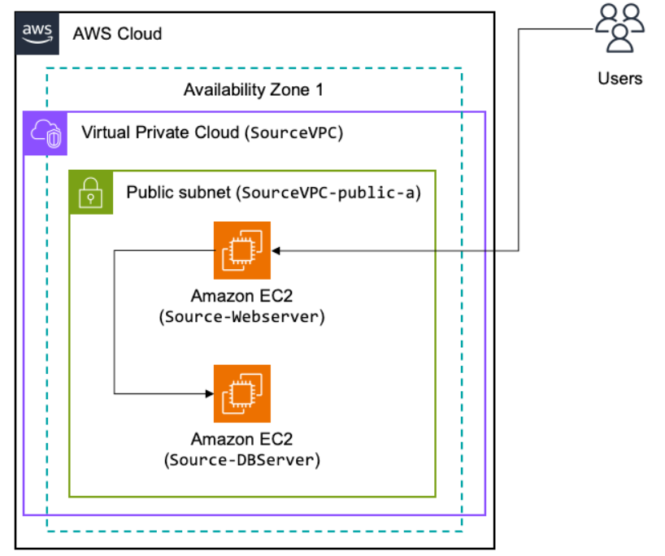

# 🏗️ AWS Application Migration Project  

## 📌 Overview  
This project demonstrates an **end-to-end AWS application migration** strategy using:  
- **AWS Application Migration Service (MGN)** – Lift-and-shift migration  
- **AWS Database Migration Service (DMS)** – Database migration and replication  
- **AWS Elastic Disaster Recovery (EDR)** – High availability and failover protection  

The goal is to migrate an application and database from an on-premises environment to AWS while ensuring **minimal downtime** and **data consistency**.

## 🛠️ Technologies & AWS Services  
- **Compute:** Amazon EC2, Application Migration Service (MGN)  
- **Database:** Amazon RDS, Database Migration Service (DMS)  
- **Networking:** Amazon VPC, Security Groups, Route 53  
- **Disaster Recovery:** Elastic Disaster Recovery (EDR)  
- **Monitoring & Logs:** AWS CloudWatch, AWS SNS  

## 📂 Architecture Diagram  
  

## 🚀 Project Implementation  
### **1. Environment Setup**  
- Created a **VPC with public/private subnets** for secure migration  
- Configured **IAM roles and security groups**  

### **2. Application Migration Using AWS MGN**  
- Installed **MGN agent** on source servers  
- Initiated real-time replication to AWS  
- Conducted **test cutover & final cutover**  

### **3. Database Migration Using AWS DMS**  
- Set up **DMS replication instance**  
- Created **source & target endpoints**  
- Validated data migration and **ensured minimal downtime**  

### **4. Elastic Disaster Recovery (EDR) Setup**  
- Enabled **multi-AZ failover**  
- Configured recovery strategies  

## 📊 Key Learnings  
- How to migrate an **entire application stack** with AWS services  
- Understanding AWS MGN and DMS replication processes  
- Best practices for **minimal downtime migration**  

## 📌 Future Enhancements  
- Implement **Infrastructure as Code (IaC) using Terraform**  
- Automate cutover processes with AWS Lambda  

---
