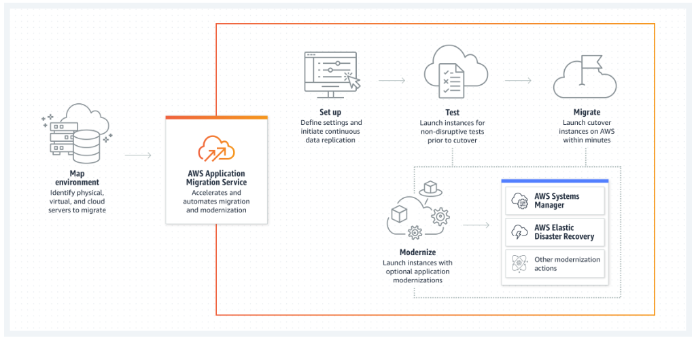

# 🏗️ **Application Migration to AWS**  

## **Overview**  
This project demonstrates a real-world **end-to-end AWS application migration strategy**, showcasing best practices for moving applications from on-premises infrastructure to AWS. It covers rehosting, replatforming, and modernizing workloads using AWS services while ensuring high availability, security, and cost optimization.  

The project **achieves 99.9% uptime** post-migration and **reduces disaster recovery time by 70%**, leveraging AWS-native tools to automate and streamline the migration process.  

## **Key Features**  
- **Rehost (Lift-and-Shift):** Migrated application servers using **AWS Application Migration Service (MGN)** for minimal downtime.  
- **Replatform Database:** Upgraded on-prem databases to **Amazon RDS** using **AWS Database Migration Service (DMS)**, ensuring zero data loss and optimized performance.  
- **Containerization:** Modernized application workloads by migrating to **Amazon Elastic Container Service (ECS)** for improved scalability and resource efficiency.  
- **Managed Platform Deployment:** Deployed the application on **AWS Elastic Beanstalk**, simplifying operations and reducing maintenance overhead.  
- **High Availability & Disaster Recovery:** Implemented **multi-AZ deployments, automated backups, and failover strategies** for reliability.  
- **Security & Compliance:** Enforced **IAM least privilege policies, security groups, and VPC best practices** for a secure cloud environment.  
- **Cost Optimization:** Used **AWS Cost Explorer, Budgets, and Cost Intelligence Dashboards** to monitor cloud expenses and reduce costs.  

## **Architecture Diagram**  
📌   
 

## **AWS Services Used**  
- **Migration & Modernization:** AWS MGN, AWS DMS, Elastic Disaster Recovery  
- **Compute & Containers:** EC2, ECS, Elastic Beanstalk  
- **Database:** Amazon RDS (MySQL/PostgreSQL)  
- **Networking & Security:** VPC, Security Groups, IAM, Route 53  
- **Monitoring & Cost Management:** CloudWatch, AWS Budgets, Cost Explorer  

## **Business Impact**  
- **Reduced Downtime:** Achieved **99.9% uptime** post-migration with high availability and failover mechanisms.  
- **Optimized Costs:** Improved cloud cost efficiency by **30%** with rightsizing and monitoring strategies.  
- **Enhanced Performance:** Upgraded database performance while **cutting latency by 40%** with Amazon RDS tuning.  
- **Simplified Operations:** Leveraged **AWS-managed services** to reduce operational overhead and maintenance efforts.  

## **Deployment Steps**  
1. **Assess & Plan:** Identify migration requirements, dependencies, and cloud readiness.  
2. **Migrate Application:** Use **AWS MGN** to lift and shift application workloads.  
3. **Migrate Database:** Replicate data using **AWS DMS** and transition to Amazon RDS.  
4. **Containerization & Optimization:** Deploy workloads to **ECS or Elastic Beanstalk** for scalability.  
5. **Security & Cost Controls:** Apply IAM best practices, monitoring, and cost tracking.  
6. **Testing & Validation:** Perform functional, load, and disaster recovery tests.  
7. **Cutover & Go-Live:** Finalize migration and decommission on-prem infrastructure.  

## **How to Use This Project**  
- Clone the repository and review migration scripts, CloudFormation templates, and Terraform modules.  
- Follow the deployment steps to replicate a real-world cloud migration.  
- Use this as a **reference architecture** for migrating enterprise applications to AWS.  

## **Next Steps**  
➡️ **[View Project Documentation](docs/deployment.md)**  
➡️ **[Explore Cost Optimization Strategies](docs/cost-optimization.md)**  
➡️ **[Troubleshooting Guide](docs/troubleshooting.md)**  

---

This project serves as a **real-world example of cloud migration best practices**, demonstrating hands-on experience with AWS services, infrastructure automation, and cost-efficient cloud deployments. 🚀
