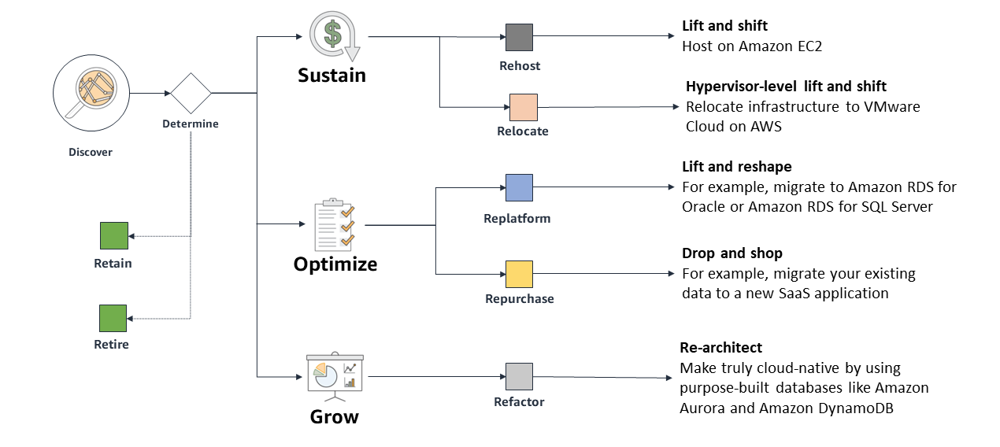

# **Database Migration Strategies**

## 📌 **Overview**
Migrating databases to AWS requires selecting the right strategy based on **business objectives, workload characteristics, and downtime tolerance**.  
The **AWS Prescriptive Guidance** outlines multiple migration strategies tailored for **relational databases**.

---

## 📊 **Common Database Migration Strategies**
AWS database migrations typically fall into one of these categories:

- **Rehost (Lift-and-Shift)**: Moves the database to AWS without modifications.
- **Replatform**: Migrates to an AWS-managed service with minimal changes.
- **Repurchase**: Moves to a new SaaS-based database solution.
- **Refactor (Re-architect)**: Completely redesigns the database for cloud-native capabilities.
- **Retain**: Keeps the database in its current environment.
- **Retire**: Decommissions the database if no longer needed.

---

## 🚀 **Migration Strategy Used in This Project**
This project focuses on **Replatforming** the database using **AWS Database Migration Service (DMS)**.

### 🔹 **What is AWS DMS?**
AWS Database Migration Service (**AWS DMS**) is a managed service that:
- **Replicates databases to AWS** with minimal downtime.
- **Supports homogeneous and heterogeneous migrations** (e.g., MySQL → Aurora).
- **Keeps data in sync** during migration.
- **Works with multiple AWS database services**, including RDS, Aurora, DynamoDB, and Redshift.

---

## 🔄 **Replatforming with AWS DMS**
In this project, we:
1. **Configured AWS DMS** to migrate a MySQL database to Amazon RDS.
2. **Set up replication** to keep the source and target databases in sync.
3. **Validated data consistency** post-migration.

This approach provides a **scalable, cost-effective, and minimal-downtime solution** for moving databases to AWS.

---

## ⏭️ **Next Steps**
➡️ **[Replatform - AWS Database Migration Service (DMS)](./replatform-database-migration.md)**
