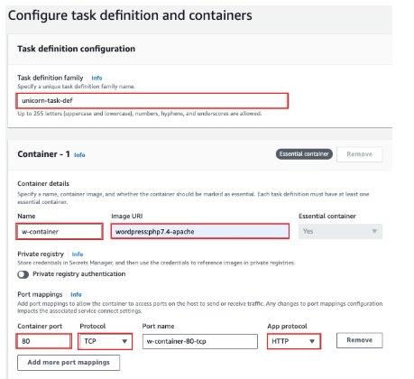
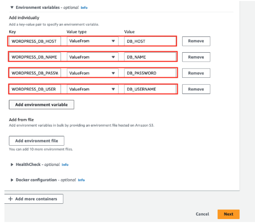
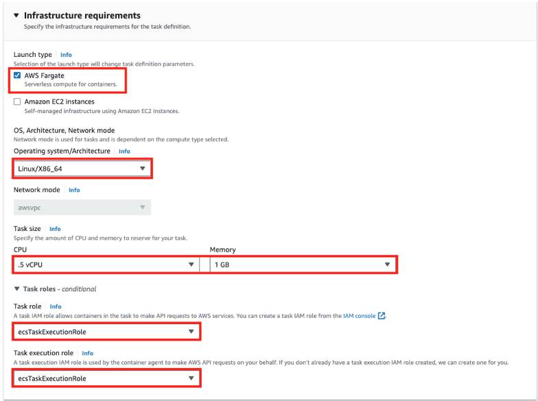
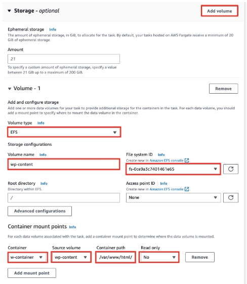
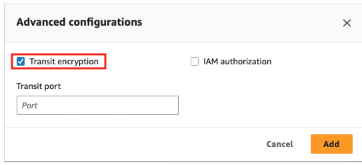

# **🚀 Create an Amazon ECS Task Definition**

## **📌 Overview**
To run my **WordPress container on ECS**, I need to define an **ECS Task Definition** that specifies:
✅ **Container Image & Ports**  
✅ **Environment Variables from Parameter Store**  
✅ **AWS Fargate as the compute environment**  
✅ **Amazon EFS for persistent storage**  

---

## **🛠️ Step 1: Create an ECS Task Definition**
📌 **Follow these steps to create an ECS Task Definition.**  

1️⃣ In **AWS Console**, go to **Services > ECS > Task Definitions**  
2️⃣ Click **Create new Task Definition**  
3️⃣ Enter the following details:  

| Parameter            | Value                      |
|----------------------|--------------------------|
| **Task Definition Name** | `unicorn-task-def`      |
| **Container Name**   | `w-container`             |
| **Image URI**        | `wordpress:php7.4-apache` |
| **Container Port**   | `80`                      |
| **Protocol**        | `TCP`                      |
| **App Protocol**     | `HTTP`                     |

---

## **🛠️ Step 2: Configure Environment Variables**
📌 **Use AWS Systems Manager Parameter Store to securely store database credentials.**  

Under **Environment variables**, select **ValueFrom** and map the values:

| Key                 | ValueFrom |
|---------------------|-----------|
| `WORDPRESS_DB_HOST` | `DB_HOST`  |
| `WORDPRESS_DB_NAME` | `DB_NAME`  |
| `WORDPRESS_DB_USER` | `DB_USERNAME` |
| `WORDPRESS_DB_PASSWORD` | `DB_PASSWORD` |

---

## **🛠️ Step 3: Configure Compute, Storage, and Security**
📌 **Select AWS Fargate as the execution environment.**  

| Parameter                  | Value                    |
|----------------------------|--------------------------|
| **App Environment**        | `AWS Fargate (serverless)` |
| **Operating System**       | `Linux/X86_64`          |
| **CPU**                    | `0.5 vCPU`              |
| **Memory**                 | `1GB`                   |
| **Task Role**              | `ecsTaskExecutionRole`  |
| **Task Execution Role**    | `ecsTaskExecutionRole`  |

---

## **🛠️ Step 4: Mount Amazon EFS to ECS Task**
📌 **Use Amazon EFS for persistent WordPress storage.**  

1️⃣ Scroll down to the **Storage** section  
2️⃣ Click **Add volume** and enter the following details:  

| Parameter          | Value                  |
|-------------------|-----------------------|
| **Volume Type**  | `EFS`                  |
| **Volume Name**  | `wp-content`           |
| **File system ID** | `<EFS Filesystem ID>`  |
| **Container**    | `w-container`           |
| **Source Volume** | `/wp-content`         |
| **Container Path** | `/var/www/html/wp-content` |
| **Read Only**    | `No`                    |

---

## **🛠️ Step 5: Enable Encryption in Transit**
📌 **Secure communication between ECS and EFS.**  

1️⃣ Scroll down to **Advanced Configurations**  
2️⃣ **Enable Encryption in Transit**  

---

## **✅ Step 6: Review & Create Task Definition**
1️⃣ Click **Review**  
2️⃣ Click **Create Task Definition**  

✅ **Task Definition successfully created!** 🎉  

---

## **📌 Next Steps**
➡️ **Step 7: [Deploy an ECS Service](./deploy-ecs-service.md)**
