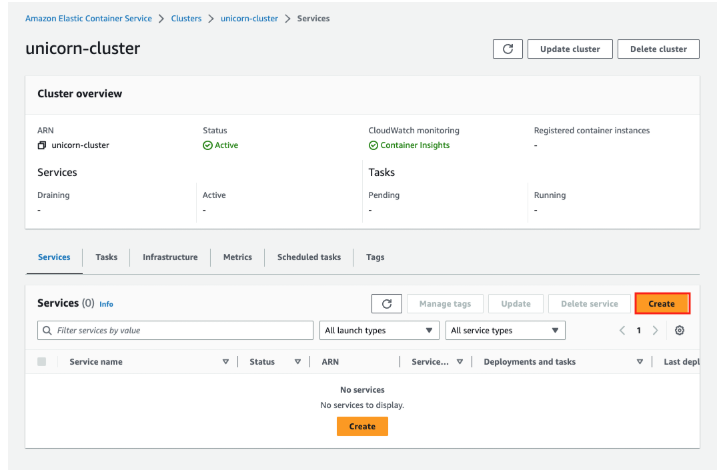
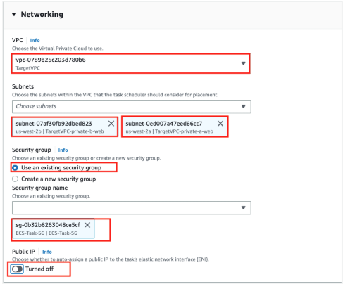
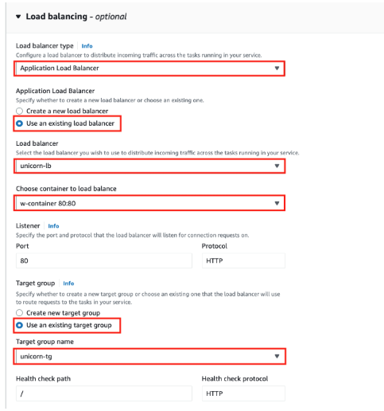
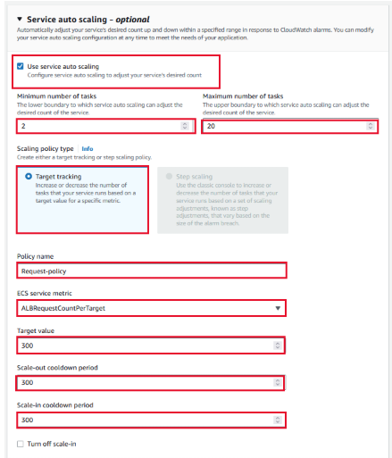

# **🚀 Deploy an Amazon ECS Service**

## **📌 Overview**
Now that I have successfully created an **ECS Task Definition**, I am ready to **deploy an ECS Service** that will manage and scale my WordPress container running on **AWS Fargate**.

✅ **Runs & maintains ECS tasks**  
✅ **Attaches to an Application Load Balancer (ALB)**  
✅ **Uses Auto Scaling to adjust container instances**  

---

## **🛠️ Step 1: Select the ECS Cluster**
📌 **Navigate to my ECS Cluster and start the service deployment.**  

1️⃣ In **AWS Console**, go to **Services > ECS > Clusters**  
2️⃣ Select the **`unicorn-cluster`** that I created earlier  
3️⃣ Click on **Services** tab  
4️⃣ Click **Create**  



---

## **🛠️ Step 2: Configure the ECS Environment**
📌 **Ensure the service is deployed in the correct ECS cluster.**  

| Parameter       | Value               |
|----------------|---------------------|
| **Cluster**    | `unicorn-cluster`   |
| **Application Type** | `Service` |
| **Family**     | `unicorn-task-def`  |
| **Revision**   | `LATEST`            |
| **Service Name** | `unicorn-svc`     |
| **Service Type** | `Replica`         |
| **Desired Tasks** | `2`               |
| **Min Running Tasks** | `100`          |
| **Max Running Tasks** | `200`          |


---

## **🛠️ Step 3: Configure Networking**
📌 **Specify networking settings for where the tasks will run.**  

| Parameter         | Value                |
|------------------|----------------------|
| **VPC**         | `TargetVPC`          |
| **Subnets**     | `TargetVPC-private-a-web`, `TargetVPC-private-b-web` |
| **Security Group** | `ECS-Tasks-SG`     |
| **Public IP**   | `OFF`                |



---

## **🛠️ Step 4: Configure Load Balancing**
📌 **Attach my ECS service to the existing ALB for traffic routing.**  

1️⃣ Select **Application Load Balancer**  
2️⃣ Choose the existing **`unicorn-lb`**  
3️⃣ Select **`w-container`** as the container  
4️⃣ Use **HTTP listener on port 80**  
5️⃣ Select **`unicorn-tg`** as the Target Group  



---

## **🛠️ Step 5: Configure Auto Scaling**
📌 **Ensure my ECS service can scale dynamically based on demand.**  

| Parameter           | Value                |
|--------------------|----------------------|
| **Min Tasks**      | `2`                  |
| **Max Tasks**      | `20`                 |
| **Scaling Policy Type** | `Target Tracking` |
| **Policy Name**    | `Request-policy`     |
| **ECS Service Metric** | `ALBRequestCountPerTarget` |
| **Target Value**   | `300`                |
| **Scale-out Cooldown** | `300` seconds   |
| **Scale-in Cooldown** | `300` seconds   |



---

## **🛠️ Step 6: Review & Deploy**
1️⃣ Click **Review**  
2️⃣ Click **Create Service**  

✅ **ECS Service successfully deployed!** 🎉  


---

## **✅ Step 7: Validate the Deployment**
📌 **Once the service is running, verify the deployment by accessing the site.**  

1️⃣ **Go to AWS Console > ECS > Services > unicorn-svc**  
2️⃣ Confirm the **Service status** is **Active**  
3️⃣ Confirm that all tasks are in **Running state**  
4️⃣ Copy the **Load Balancer DNS Name**  
5️⃣ Open it in my browser:  

http://<LOAD_BALANCER_DNS>
```

---

## **🛠️ Troubleshooting**
📌 **If I encounter issues, check the following steps:**  

### **🔹 Issue: CSS & Images Not Loading**
If I see **missing styles** or images, I need to update my WordPress database to reflect the new URL:
```sql
UPDATE wp_options SET option_value = replace(option_value, 'http://old-url/', 'http://new-lb-url/');
UPDATE wp_postmeta SET meta_value = replace(meta_value,'http://old-url/','http://new-lb-url/');
```
🔹 Issue: ECS Tasks Going to STOPPED State
If my tasks go from PENDING → STOPPED, I can check logs:
1️⃣ Go to ECS > Tasks > Stopped
2️⃣ Click on the stopped task and check the error message

🔍 Common error:
```
"CannotPullContainerError: toomanyrequests: You have reached your pull rate limit."
```
📌 Solution: Authenticate with Docker Hub to increase the pull rate limit.

📷 ECS Task Troubleshooting Guide
➡️ **[Troubleshoot Deployment Issues](../docs/troubleshooting.md)**  
