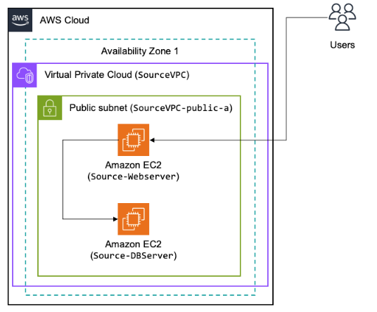

# 🛠️ Discovering and Analyzing My Environment with AWS Application Discovery Service  

## **Overview**  

In this phase, I will **discover and analyze** my environment using **AWS Application Discovery Service (AWS ADS)** to assess the migration process. AWS ADS helps collect configuration data and usage patterns from my on-premises servers to determine the best migration strategy.

AWS ADS integrates with the following services to enhance migration insights:
- **AWS Migration Hub** – Centralized migration tracking
- **Amazon Athena** – Querying migration data
- **Amazon S3** – Storage for collected data
- **Migration Evaluator** – Cost and feasibility assessment
- **AWS Database Migration Service (DMS) Fleet Advisor** – Database migration insights  

---

## **Application Discovery Methods**  

AWS ADS provides two ways to collect server and database information:

### **1️⃣ Agentless Discovery**
🔹 **Best for VMware environments**  
I can deploy the **Application Discovery Service Agentless Collector (OVA file)** via **VMware vCenter** to collect:  
✅ Server hostnames, IP/MAC addresses  
✅ Disk resource allocations  
✅ Database schemas & versions  
✅ Average & peak CPU, RAM, and Disk I/O utilization  

### **2️⃣ Agent-Based Discovery**
🔹 **Best for physical & non-VMware servers**  
For more detailed insights, I will install the **AWS Application Discovery Agent** on my servers, which provides:  
✅ **Static configuration data**  
✅ **Time-series performance metrics**  
✅ **Inbound/outbound network connections**  
✅ **Running processes and dependencies**  

For this project, I will **install the AWS ADS Agent** on each server and analyze the collected data in **AWS Migration Hub**.

---

## **💡 Architecture Overview**  

My **source environment** consists of **two EC2 instances**:

| **Server**  | **Function**  | **OS**  | **Application** |
|------------|-------------|--------|---------------|
| **Web Server** | Java Tomcat Application | Ubuntu Linux | Hosts my web app |
| **Database Server** | PostgreSQL Database | Ubuntu Linux | Stores relational data |

⚠️ **The environment is deliberately non-optimal** to showcase **modernization strategies** during migration.

### **Source Environment Architecture**

📌 *This image represents my current infrastructure setup before migration.*

---

## **🔎 Reviewing Discovered Data**
Once the AWS ADS agent is installed, I will:  

1️⃣ **View discovered servers** in **AWS Migration Hub**  
2️⃣ **Analyze performance metrics** such as CPU, memory, and disk usage  
3️⃣ **Identify dependencies** between my application and database  

---

## **📌 Next Steps**  
➡️ **[Deploy the Migration Hub and Review Insights](migration-hub-analysis.md)**  
