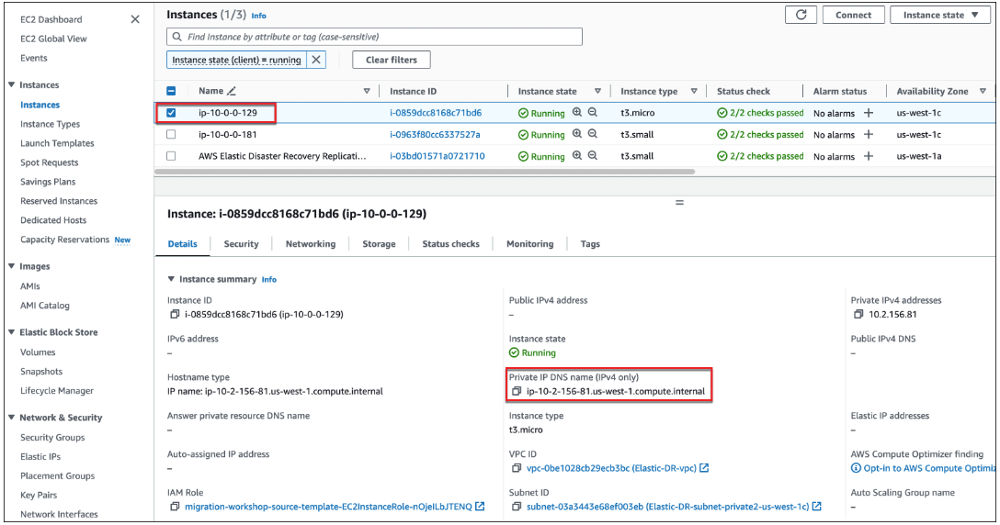
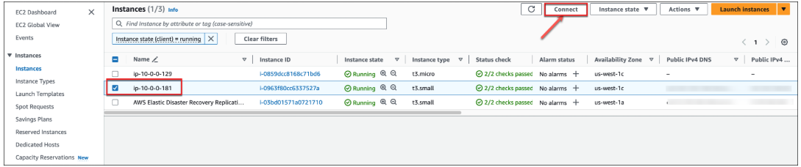
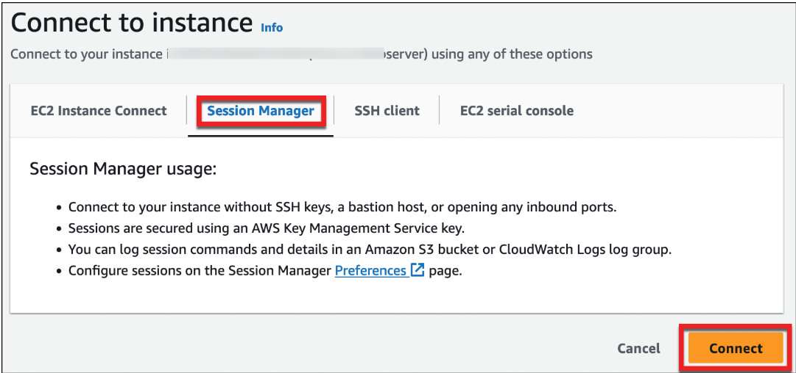
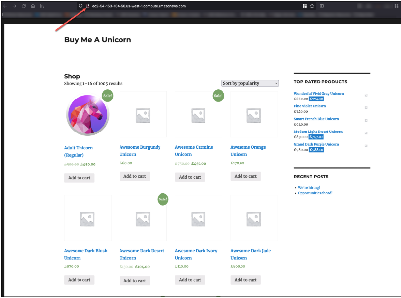

# **🔹 Configuring the Recovered Web Application**

## **📌 Overview**
Now that the **disaster recovery instances** have been launched, AWS Elastic Disaster Recovery Service has created **EC2 instances** in the DR environment. However, these instances are still configured to the **original source environment**.

🔹 **Goal:**  
I will update the **web application configuration** to connect to the **new DR database**.

---

## **📍 Step 1: Retrieve the DR Database Instance Details**
1️⃣ In the **AWS Console**, go to:  
   ➝ **Services → Compute → EC2**  
2️⃣ Select **Instances** from the left navigation panel.  
3️⃣ Locate the **Database Server** instance (matching the hostname recorded earlier in **Elastic Disaster Recovery → Source Servers**).  
4️⃣ Copy and save the **Private IPv4 DNS Name**.  
**  

---

## **📍 Step 2: Update the Web Server Configuration**
1️⃣ In **AWS Console**, go to:  
   ➝ **Services → Compute → EC2**  
2️⃣ Select **Instances** from the left navigation panel.  
3️⃣ Locate the **Web Server** instance (matching the hostname recorded earlier in **Elastic Disaster Recovery → Source Servers**).  
4️⃣ Click **Connect** at the top right.  
**  

5️⃣ Select **Session Manager** and click **Connect** to open a terminal session.  
**  

6️⃣ Run the following script in the terminal, replacing `<recovery Database server private IP DNS name>` with the **Private IPv4 DNS Name** from Step 1.  
```bash
sudo su -
sed -i "s|^.*DB_USER.*$|define( 'DB_USER', 'wordpress-user' );|" /var/www/html/wp-config.php
sed -i "s|^.*DB_PASSWORD.*$|define( 'DB_PASSWORD', 'AWSRocksSince2006' );|" /var/www/html/wp-config.php
sed -i "s|^.*DB_HOST.*$|define( 'DB_HOST', '<recovery Database server private IP DNS name>' );|" /var/www/html/wp-config.php
echo "define('WP_SITEURL', 'http://$(curl -s http://169.254.169.254/latest/meta-data/public-hostname)');" >> /var/www/html/wp-config.php
echo "define('WP_HOME', 'http://$(curl -s http://169.254.169.254/latest/meta-data/public-hostname)');" >> /var/www/html/wp-config.php
```
7️⃣ After executing the script, exit the session:
```
exit
```
📷 Modify Web Server Configuration

📍 Step 3: Validate the Recovery Web Application
1️⃣ In AWS Console, go to:
➝ Services → Compute → EC2
2️⃣ Select Instances from the left navigation panel.
3️⃣ Locate the Web Server instance.
4️⃣ Copy the Public IPv4 DNS from the Details tab.
📷 Web Server Public DNS

5️⃣ Open a web browser and paste the copied Public IPv4 DNS to check if the application is functional.
📌 Use HTTP instead of HTTPS, as SSL is not configured.
**

✅ Final Verification
✔️ The Web Server now connects to the recovery Database Server.
✔️ The application is functional in the disaster recovery region.
✔️ The migration using AWS Elastic Disaster Recovery is successful! 🚀

🎯 Next Steps
➡️ **[AWS Optimization Strategies](../docs/optimization.md)** 
