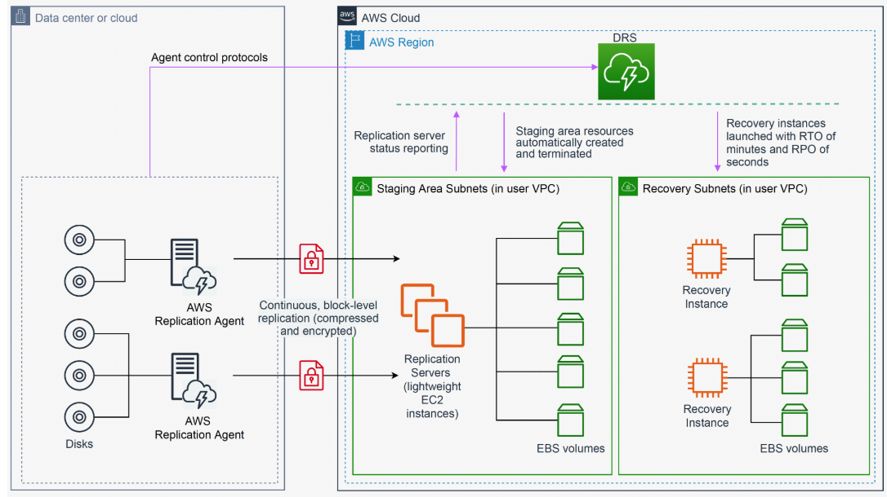

# **🔹 AWS Elastic Disaster Recovery (EDR) Overview**

## **📌 What is AWS Elastic Disaster Recovery?**
AWS **Elastic Disaster Recovery (AWS EDR)** minimizes **downtime and data loss** by enabling **fast and reliable recovery** of on-premises and cloud-based applications using:
- **Affordable storage** 📦
- **Minimal compute usage** 🖥️
- **Point-in-time recovery** ⏳

With **AWS EDR**, I can:
✅ **Increase IT resilience** by replicating applications across AWS Regions  
✅ **Use the AWS Console** to configure and monitor replication  
✅ **Recover applications within minutes** in case of a disaster  

---

## **⚙️ How AWS EDR Works**
1️⃣ **Set up AWS Elastic Disaster Recovery on source servers** to initiate secure replication.  
2️⃣ **Data is replicated** to a **staging area subnet** in the **AWS Region I select**.  
3️⃣ **Staging area reduces costs** by using **affordable storage & minimal compute**.  
4️⃣ **AWS EDR automatically converts servers** to run natively on AWS when recovery is needed.  
5️⃣ **Recovery instances launch within minutes** using:
   - **Latest server state** 🟢
   - **Previous point in time** ⏳

**

---

## **📌 Disaster Recovery Strategy**
### **📍 Scenario:**  
- My **primary application** runs in **AWS Region: `us-west-2`**.  
- I will **replicate data** to a **DR AWS Region: `us-west-1`**.  
- I will **simulate a disaster event** and trigger a **recovery job**.
- **Business continuity** will be maintained by launching my application in the **DR Region**.

**

---

## **📌 Disaster Recovery Process**
🔹 **Step 1:** Set up the **Disaster Recovery (DR) network environment**  
🔹 **Step 2:** Initialize **AWS Elastic Disaster Recovery** in the DR Region  
🔹 **Step 3:** Install **replication agents** on the source servers  
🔹 **Step 4:** Configure **EC2 launch settings** for the DR instances  
🔹 **Step 5:** **Trigger a disaster recovery job** 🚀  
🔹 **Step 6:** Configure the **DR application settings**  

---

## **🚀 Next Steps**
➡️ **[Proceed to Step 1: Setting Up DR Network Environment](./elastic-disaster-recovery-setup.md)**
