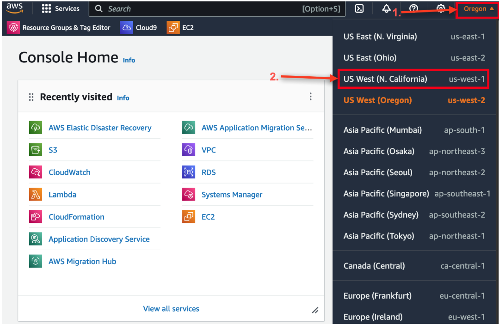
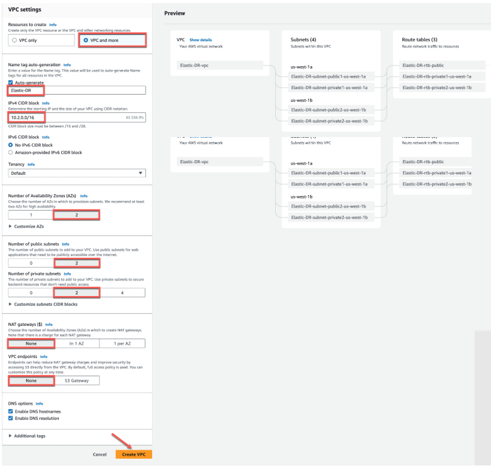
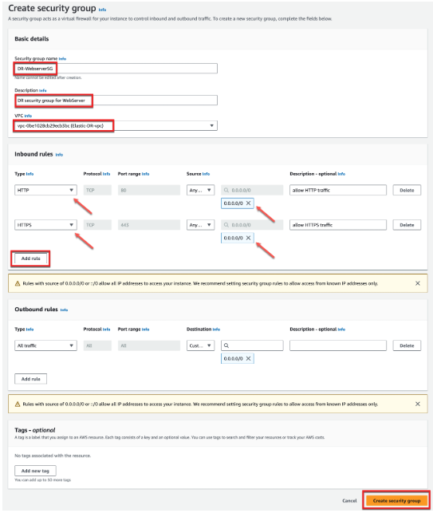
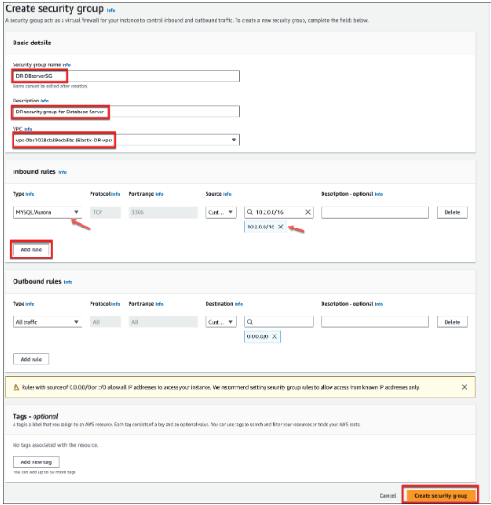

# **🔹 Setting Up Disaster Recovery (DR) Network**

## **📌 Overview**
To prepare for **Disaster Recovery (DR)**, I need to set up **networking requirements** in my **DR AWS Region (`us-west-1`)**. This setup includes:
✅ Creating a **new DR VPC**  
✅ Configuring **Security Groups** for application and database servers  

---

## **📍 Step 1: Select the Disaster Recovery Region**
1️⃣ In the **AWS Console**, click on the **AWS Region tab** (top right corner).  
2️⃣ Select **N. California (`us-west-1`)** as the **new DR Region**.  
3️⃣ Ensure that **N. California** is displayed before continuing.  

**  
**  

---

## **📍 Step 2: Create a Disaster Recovery VPC**
1️⃣ In the **AWS Console**, navigate to:  
   **Services → VPC**  
2️⃣ Click **Create VPC**.  
3️⃣ Under **VPC settings**, select **VPC and more**.  
4️⃣ Configure the parameters as follows:

| Parameter             | Value         |
|-----------------------|--------------|
| **Name tag**         | `Elastic-DR` |
| **IPv4 CIDR block**  | `10.2.0.0/16` |
| **Availability Zones (AZs)** | `2` |
| **Public subnets**   | `2` |
| **Private subnets**  | `2` |
| **NAT gateway**      | `None` |
| **VPC endpoint**     | `None` |

5️⃣ Click **Create VPC**.  

**  

---

## **📍 Step 3: Create Disaster Recovery Security Groups**
### **🔹 Web Server Security Group**
1️⃣ In the **AWS Console**, go to:  
   **Services → VPC → Security Groups**  
2️⃣ Click **Create Security Group**.  
3️⃣ Configure the parameters as follows:

| Parameter              | Value                     |
|------------------------|--------------------------|
| **Security Group Name** | `DR-WebserverSG` |
| **Description**        | `DR security group for WebServer` |
| **VPC**               | `Elastic-DR` |

4️⃣ Under **Inbound rules**, select **Add rule** and configure:

| Inbound Rule | Type   | Source         |
|-------------|--------|---------------|
| 1          | HTTP   | Anywhere-IPv4 |
| 2          | HTTPS  | Anywhere-IPv4 |

5️⃣ Click **Create Security Group**.  

**  

---

### **🔹 Database Server Security Group**
1️⃣ Repeat the above steps to create a new security group.  
2️⃣ Configure the parameters as follows:

| Parameter              | Value                      |
|------------------------|---------------------------|
| **Security Group Name** | `DR-DBserverSG` |
| **Description**        | `DR security group for Database Server` |
| **VPC**               | `Elastic-DR` |

3️⃣ Under **Inbound rules**, select **Add rule** and configure:

| Inbound Rule | Type            | Source          | Value       |
|-------------|----------------|---------------|------------|
| 1          | MYSQL/Aurora    | Custom        | `10.2.0.0/16` |

4️⃣ Click **Create Security Group**.  

**  

---

## **🚀 Next Steps**
Now that the **Disaster Recovery network settings** are in place, I will:  
➡️ **Initialize AWS Elastic Disaster Recovery (EDR) for the DR AWS Region**.  

📌 **[Proceed to Next Step: Initializing AWS EDR](./elastic-disaster-recovery-initialize.md)**  
