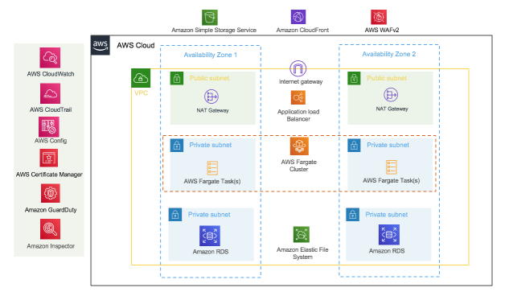

# **🔹 AWS Optimization Strategies**

## **🎉 Congratulations!**
Since you're here, you've successfully **migrated an e-commerce application to AWS**! Now, it's time to **optimize the architecture** to make it even more **secure, highly-performant, resilient, and cost-efficient** using **AWS Well-Architected** best practices.

The **AWS Well-Architected Framework** consists of **five key pillars**:
1️⃣ **Operational Excellence**  
2️⃣ **Security**  
3️⃣ **Reliability**  
4️⃣ **Performance Efficiency**  
5️⃣ **Cost Optimization**  

## **🚀 Optimization Strategies**

---

## **🔹 1. Operational Excellence**
✅ **Configure a CloudWatch Dashboard**  
   - Monitor your resources in **a single view** across AWS Regions.  
   - Helps in proactive monitoring & issue resolution.  
   
✅ **Enable AWS CloudTrail**  
   - **Persistent logging** of all API actions in your AWS account.  
   - Helps with auditing & security monitoring.  

📖 **Learn More:** [CloudWatch Dashboards](https://docs.aws.amazon.com/AmazonCloudWatch/latest/monitoring/CloudWatch_Dashboards.html) | [AWS CloudTrail](https://docs.aws.amazon.com/awscloudtrail/latest/userguide/cloudtrail-create-a-trail-using-the-console-first-time.html)  

---

## **🔹 2. Security**
✅ **Switch to HTTPS with AWS Certificate Manager (ACM)**  
   - Secure your web application with **managed SSL/TLS certificates**.  

✅ **Encrypt EBS Volumes**  
   - Ensure that **customer data at rest** is protected with AWS-managed encryption.  

✅ **Enable AWS WAF (Web Application Firewall)**  
   - Protect your web app from known threats & malicious traffic.  
   - Can be deployed on **ALB (Application Load Balancer)** or **CloudFront**.  

✅ **Use Amazon GuardDuty**  
   - **Intelligent threat detection** and continuous AWS account monitoring.  

📖 **Learn More:** [AWS Certificate Manager](https://docs.aws.amazon.com/acm/latest/userguide/gs-acm-request-public.html) | [EBS Encryption](https://docs.aws.amazon.com/AWSEC2/latest/UserGuide/EBSEncryption.html) | [AWS WAF](https://docs.aws.amazon.com/waf/latest/developerguide/what-is-aws-waf.html) | [GuardDuty](https://docs.aws.amazon.com/guardduty/latest/ug/what-is-guardduty.html)  

---

## **🔹 3. Reliability**
✅ **Configure an Application Load Balancer (ALB)**  
   - Distribute web traffic **across multiple Availability Zones**.  

✅ **Enable Amazon EC2 Auto Scaling**  
   - **Auto-heal** failed EC2 instances & dynamically scale resources.  

✅ **Use Amazon CloudFront**  
   - **Global Content Distribution Network (CDN)** for fast & secure content delivery.  
   - Integrates with **AWS Shield** for **DDoS mitigation**.  

📖 **Learn More:** [Application Load Balancer](https://docs.aws.amazon.com/elasticloadbalancing/latest/application/introduction.html) | [EC2 Auto Scaling](https://docs.aws.amazon.com/autoscaling/ec2/userguide/what-is-amazon-ec2-auto-scaling.html) | [CloudFront](https://docs.aws.amazon.com/AmazonCloudFront/latest/DeveloperGuide/Introduction.html)  

---

## **🔹 4. Performance Efficiency**
✅ **Deploy Amazon Elastic File System (EFS)**  
   - Centralized **file storage** for web server scaling.  

✅ **Use Amazon CloudFront with S3 as a Custom Origin**  
   - **Lower latency & reduce storage costs** for **static content**.  

📖 **Learn More:** [EFS Overview](https://docs.aws.amazon.com/efs/latest/ug/whatisefs.html) | [CloudFront with S3](https://docs.aws.amazon.com/AmazonCloudFront/latest/DeveloperGuide/DownloadDistS3AndCustomOrigins.html)  

---

## **🔹 5. Cost Optimization**
✅ **Use Amazon EC2 Spot Instances**  
   - Select instance types with **Spot Advisor** for up to **90% savings**.  
   - Some instance types have **<5% interruption rate**.  

✅ **Choose the Most Cost-Optimized EC2 Instances**  
   - Select instance types based on **workload requirements** for better efficiency.  

📖 **Learn More:** [Spot Instances](https://aws.amazon.com/ec2/spot/) | [EC2 Instance Selection](https://docs.aws.amazon.com/AWSEC2/latest/UserGuide/instance-types.html)  

---

## **📌 Reference Architecture**
Below is a **reference architecture** implementing the above optimizations:

**  

🔗 **For more details, check the official [WordPress on AWS Reference Architecture](https://aws.amazon.com/quickstart/architecture/wordpress/)**  

---

➡️ **[Cleanup Guide](../docs/cleanup.md)** 
