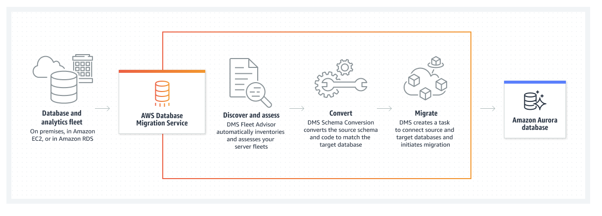

# 🚀 **Replatform - AWS Database Migration Service (DMS)**

## **Overview**
In this section, I will perform a **database migration** using **AWS Database Migration Service (DMS)**—a managed migration and replication service designed for secure, fast, and **minimal downtime** database migrations.

AWS DMS supports over **20 database and analytics engines**, including both **homogeneous** (e.g., **MySQL to MySQL**) and **heterogeneous** (e.g., **Oracle to PostgreSQL**) migrations, as well as single-time or continuous **real-time replication**.

### **🔹 Migration Goal**
I will migrate a **standalone MySQL database** from the **SourceVPC** to an **Amazon RDS MySQL instance** running in the **TargetVPC**.

---

## **📌 Database Migration Service Architecture**
AWS DMS uses a **Replication Instance** to facilitate database movement between the **source** and **target databases**.

📷 **_Insert Architecture Screenshot Here_**  
  
**🔗 [View Full Image](assets/dms-architecture.png)**

---

## **🛠️ Steps to Perform the Migration**
I will go through the following **stages** in this database migration process:

1️⃣ **Setup Network**  
   - Configure **VPC, subnets, and security groups** for database migration.

2️⃣ **Create Target Database (Amazon RDS MySQL)**  
   - Launch a **managed MySQL RDS instance** in **TargetVPC**.

3️⃣ **Create Replication Instance**  
   - Provision an **AWS DMS replication instance** to handle data migration.

4️⃣ **Configure Source Database**  
   - Modify the **MySQL database** on the **SourceVPC** for migration.

5️⃣ **Create Source and Target Endpoints**  
   - Define **DMS endpoints** for **source** (self-managed MySQL) and **target** (Amazon RDS MySQL).

6️⃣ **Create and Run Replication Task**  
   - Initiate **AWS DMS migration task** to move data from source to target.

7️⃣ **Migration Summary**  
   - Review **data consistency**, confirm a **successful migration**, and ensure all workloads function correctly.

---

## **🎯 Next Steps**
➡️ Proceed to **[Setup Network](./setup-network.md)** to configure networking for AWS DMS.
