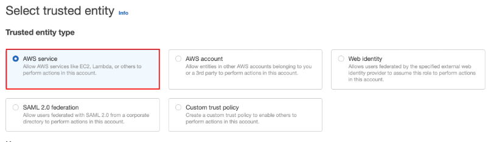
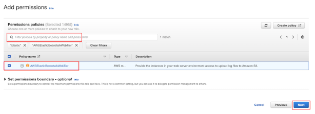
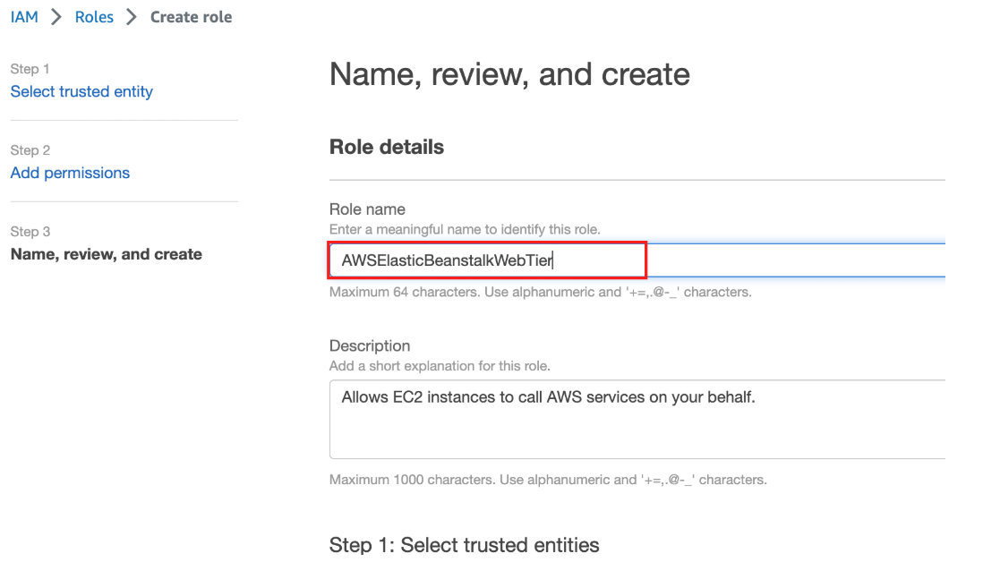

# **🚀 Create an IAM Instance Role for AWS Elastic Beanstalk**

## **📌 Overview**
To deploy my application on **AWS Elastic Beanstalk**, I need to:
✅ **Create an IAM Role** that grants the EC2 instances **permission** to interact with AWS services.  
✅ **Attach the role** to instances managed by Elastic Beanstalk.

This role allows the EC2 instances running my application to access **Amazon S3**, **CloudWatch Logs**, and other AWS resources securely.

---

## **🛠️ Step 1: Create an Instance Role**
📌 **I will create an IAM Role for EC2 instances managed by Elastic Beanstalk.**

### **🔹 Open IAM Roles Console**
1. Open **AWS Console** and navigate to **IAM**:  
   [🔗 AWS IAM Console](https://console.aws.amazon.com/iam/)
2. In the left menu, click **Roles**.
3. Click the **Create Role** button.


---

### **🔹 Step 2: Select Trusted Entity**
1. Under **Trusted entity type**, select **AWS Service**.
2. Under **Use case**, select **EC2**.
3. Click **Next**.



---

### **🔹 Step 3: Attach Permissions**
1. In the **Permissions policies** section, search for **AWSElasticBeanstalkWebTier**.
2. Check the box next to it.
3. Click **Next**.



---

### **🔹 Step 4: Name the Role**
1. In the **Role Name** field, enter:
ElasticBeanstalkInstanceRoleWeb
```2. Click **Create Role** at the bottom of the page.


```

---

## **✅ Next Steps**
➡️ **[🚀 Launch AWS Elastic Beanstalk Environment](../docs/replatform-eb-launch.md)** 

