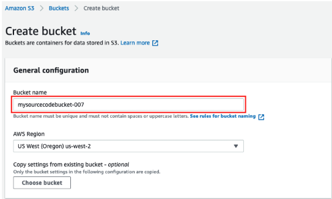

# **🚀 Upload Source Code to S3 for AWS Elastic Beanstalk Migration**

## **📌 Overview**
Now that I have prepared my application source code, I need to:
✅ **Create an S3 bucket** to store my application bundle  
✅ **Upload the source code ZIP file** to the S3 bucket  

This is necessary because AWS Elastic Beanstalk **retrieves the application code from S3** during deployment.

---

## **🛠️ Step 1: Create an S3 Bucket**
📌 **I will create an S3 bucket to store my source code bundle.**

### **🔹 Create an S3 Bucket**
1. Open **AWS Console** and navigate to **S3**: [🔗 AWS S3 Console](https://console.aws.amazon.com/s3/)
2. Click **Create bucket**.
3. Enter a **Bucket name** (must be unique across all AWS accounts):

mysourcecodebucket-xxxx
📌 Replace `xxxx` with a random number to ensure uniqueness.
4. Select **Region**: `US West (Oregon) (us-west-2)`
5. Keep all other settings as default.
6. Scroll down and click **Create bucket**.



📌 **I will take note of my bucket name** as I will use it in the next step.

---

## **🛠️ Step 2: Upload Source Code to S3**
📌 **I will upload the `wordpress-beanstalk.zip` file to S3.**

### **🔹 Connect to Source Webserver**
I will connect to the **Source Webserver** using:
- **SSH** ([Windows Guide](https://docs.aws.amazon.com/AWSEC2/latest/UserGuide/AccessingInstancesWindows.html) | [Mac Guide](https://docs.aws.amazon.com/AWSEC2/latest/UserGuide/AccessingInstancesLinux.html))
- **AWS Session Manager** (for browser-based access)

📌 **Steps to Connect Using AWS Session Manager**:
1. Open the **Amazon EC2 Console**: [🔗 AWS EC2 Console](https://console.aws.amazon.com/ec2/)
2. In the left panel, select **Instances**.
3. Select the **Source Webserver** instance and click **Connect**.
4. Choose **Session Manager** as the connection method.
5. Click **Connect**.

---

### **🔹 Upload the ZIP File to S3**
```bash
cd /tmp/
aws s3 cp wordpress-beanstalk.zip s3://NAME_OF_YOUR_S3_BUCKET
```
📌 I will replace NAME_OF_YOUR_S3_BUCKET with my actual S3 bucket name.
🛠️ Step 3: Verify the Upload
🔹 Check File in S3
Open AWS Console and navigate to S3: 🔗 AWS S3 Console
Select my S3 bucket (e.g., mysourcecodebucket-007).
I should see wordpress-beanstalk.zip inside my bucket.
Click on wordpress-beanstalk.zip.
Copy the Object URL and save it in a notepad.
📷 S3 Source Bundle Upload Screenshot

📌 I will save the Object URL because I will use it later when setting up the application source in AWS Elastic Beanstalk.

✅ Next Steps
➡️ **[Create an IAM Instance Role for AWS Elastic Beanstalk](../docs/replatform-eb-instance-role.md)** 
