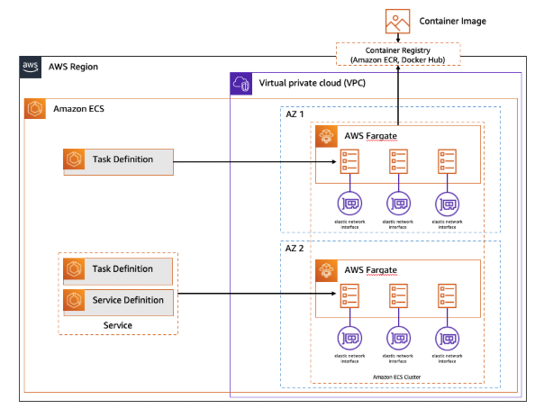

# **🚀 Replatforming to Amazon Elastic Container Service (ECS)**

## **📌 Prerequisites**
Before proceeding with replatforming to Amazon ECS, I have already completed:
- ✅ **Database Migration** → Replatformed the database using **AWS Database Migration Service (DMS)**
- ✅ **Application Migration** → Rehosted the application using **AWS Application Migration Service (MGN)**

---

## **📖 Amazon ECS Overview**
Amazon Elastic Container Service (ECS) is a **fully managed container orchestration service** that allows me to run and scale containerized applications with ease.

I can deploy my ECS workloads using:
- **AWS Fargate** → Serverless compute for containers (No EC2 management required)
- **EC2 instances** → Self-managed instances for container orchestration

📌 **For this project, I will use the AWS Fargate launch type** to remove the operational overhead of provisioning and managing infrastructure.

📷 **ECS Fargate Architecture Overview**  
👉 

---

## **🛠️ Amazon ECS Core Components**
Here are the key components that I will be using in my ECS setup:

### **🔹 ECS Cluster**
A **logical grouping of compute resources** where tasks run.  
📌 **I will create an ECS cluster with Fargate as the compute option.**

### **🔹 Task Definition**
A **JSON configuration file** that defines how my containerized application will run.  
📌 **I will define the container image, CPU/memory limits, environment variables, and networking.**

### **🔹 Task**
An **instance of a task definition** running inside an ECS cluster.  
📌 **I will configure my web application to run as a task within ECS.**

### **🔹 ECS Service**
A service in ECS ensures that a **specified number of tasks are always running** in the cluster.  
📌 **I will use an ECS service to maintain the desired number of running application instances.**

---

## **🚀 Migration Plan: Moving the Web Application to Containers**
To migrate my web application to Amazon ECS, I will perform the following actions:

### **Step 1️⃣: Create Security Groups for ECS**
- Configure security groups for the ECS cluster, Fargate tasks, and load balancer.

### **Step 2️⃣: Set Up Amazon Elastic File System (EFS)**
- Create a shared file system for persistent data storage.

### **Step 3️⃣: Store Database Credentials in AWS Systems Manager**
- Use AWS Systems Manager Parameter Store for secure database connection management.

### **Step 4️⃣: Deploy an AWS Elastic Load Balancer (ALB)**
- Set up an **Application Load Balancer (ALB)** to distribute traffic to ECS tasks.

### **Step 5️⃣: Create an Amazon ECS Cluster**
- Set up an ECS cluster with AWS Fargate as the compute engine.

### **Step 6️⃣: Define an ECS Task Definition**
- Configure the task definition, specifying container settings, environment variables, and networking.

### **Step 7️⃣: Deploy an ECS Service**
- Launch and maintain running instances of the web application on Amazon ECS.

---

## **📌 Next Steps**
➡️ **Step 1: [Set Up Security Groups](./set-up-security-groups.md)**  
➡️ **Step 2: [Create Amazon EFS](./create-efs.md)**  
➡️ **Step 3: [Store Database Credentials in SSM](./store-db-credentials.md)**  
➡️ **Step 4: [Deploy Application Load Balancer](./deploy-alb.md)**  
➡️ **Step 5: [Create ECS Cluster](./create-ecs-cluster.md)**  
➡️ **Step 6: [Define ECS Task](./define-ecs-task.md)**  
➡️ **Step 7: [Deploy ECS Service](./deploy-ecs-service.md)**  

---

## **🎉 Migration to Containers Begins!**
I am now ready to **replatform my web application to ECS** and take full advantage of **serverless container orchestration** with AWS Fargate. 🚀  
