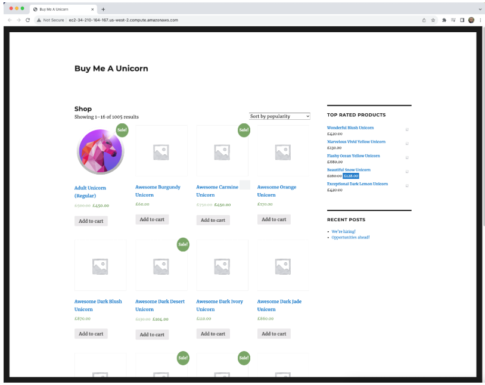
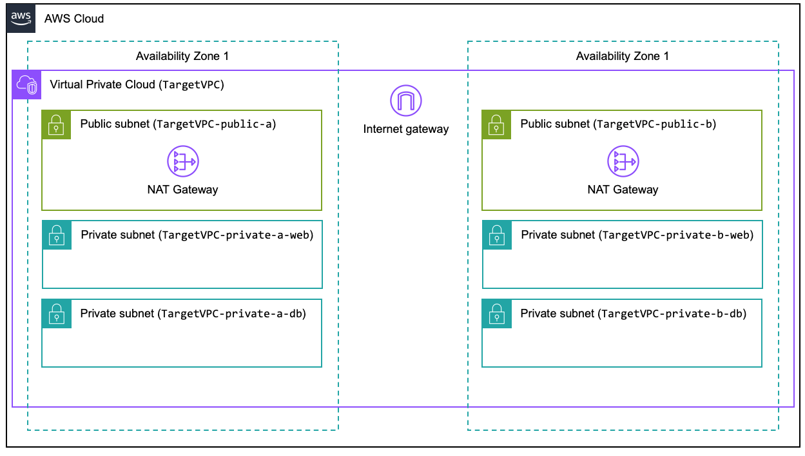

# **Review Deployed Environment**

## **Overview**
This project showcases a **real-world AWS migration strategy**, moving workloads from an **on-premises environment** to the AWS Cloud. The migration process follows best practices for **scalability, security, and high availability**, utilizing AWS services such as:

- **AWS Application Migration Service (MGN)** – Lift-and-shift migration
- **AWS Database Migration Service (DMS)** – Database replatforming
- **Amazon ECS & Elastic Beanstalk** – Modernizing application workloads
- **AWS Elastic Disaster Recovery (EDR)** – Ensuring business continuity

---

## **Source Environment**
Typical enterprise applications reside in **on-premises virtualized data centers**. In this migration project, the **source environment is simulated in AWS** using a dedicated **Amazon VPC (`SourceVPC`)**.

### **Source Workload Components**
- **Application Server (`Source-Webserver`)**
  - Hosts an **eCommerce Web Application** (WordPress + WooCommerce)
  - Runs on **PHP 7.x**
  - Deployed on **Amazon Linux**

- **Database Server (`Source-DBServer`)**
  - Uses **self-managed MySQL 5.7.x**
  - Runs on **Amazon Linux**

### **Accessing the Source Application**
To access the sample application:
1. Navigate to **AWS Console → CloudFormation → ApplicationMigrationStack → Outputs**
2. Locate the `WebServerDNSName` value.
3. Open a browser and enter the **DNS name** over **HTTP**.
4. You should see the **eCommerce application homepage**.

📌 

---

## **Target Environment**
As workloads are migrated, they will transition into a **well-architected AWS infrastructure** for improved **security, availability, and cost efficiency**.

### **TargetVPC Configuration**
✅ **Multi-AZ Deployment** – Ensures **high availability**  
✅ **Private Subnets** – Application and database tiers **segmented for security**  
✅ **Security Groups & IAM Roles** – Follows **least privilege access** best practices  
✅ **Scalable & Resilient** – Enables **auto-scaling and load balancing**  

### **Current Target Environment State**
The **TargetVPC** is **provisioned but currently empty**. As the migration progresses, application workloads and databases will be deployed incrementally.

📌 **AWS VPC Target Environment Architecture**

---

## **Next Steps**
➡️ **[Deploy Migration Strategy](../docs/deployment.md)**  
➡️ **[Troubleshoot Issues](../docs/troubleshooting.md)**  

---

## **Project Summary**
This project serves as a **hands-on real-world AWS migration** demonstration. By the end, the **application will be fully migrated and modernized** using **AWS best practices**.

✅ **Migrated WordPress eCommerce Application**  
✅ **Database transitioned from self-managed MySQL to Amazon RDS**  
✅ **Application rehosted & modernized on AWS services**  
✅ **Infrastructure optimized for scalability & cost efficiency**  

This structured approach **showcases expertise in AWS migrations**—a critical skill for **Cloud Engineers and Solutions Architects**.

---
