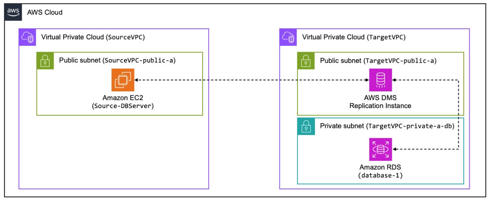
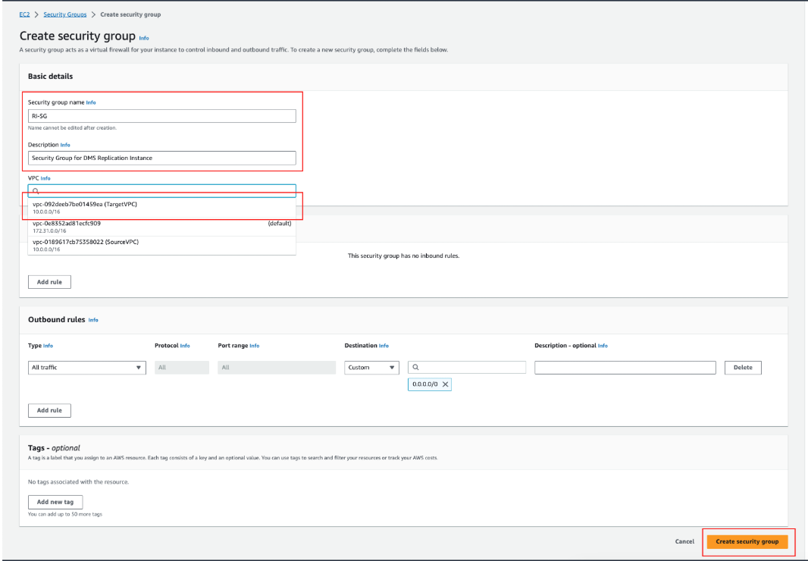
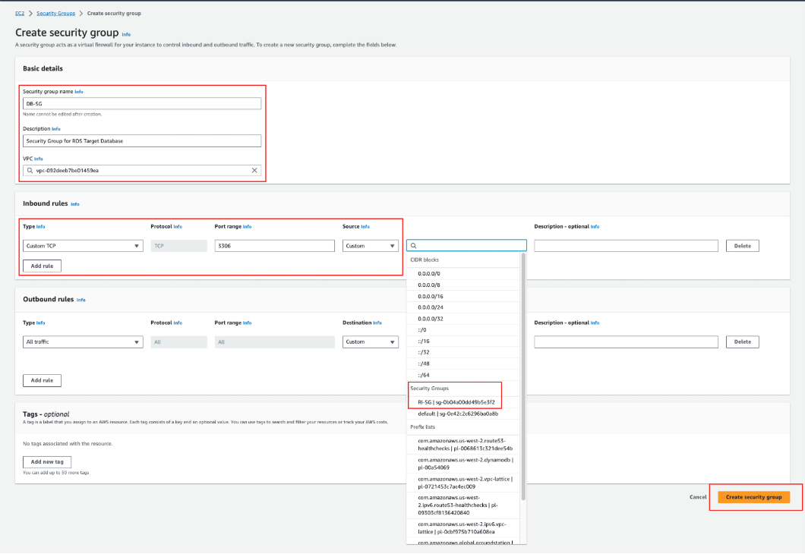

# 🚀 **Set Up Network for Database Migration**

## **Overview**
In this section, I will configure the network settings required for **AWS Database Migration Service (DMS)** to migrate data from the **source database** to the **Amazon RDS target database**.

The **lab environment** does not have a **private interconnection** (e.g., **VPN or AWS Direct Connect**) between the **source** and **target** environments. Instead, the **DMS Replication Instance** will be provisioned in a **public subnet** within the **TargetVPC**, where it will establish a **secure connection over the internet** to access the **source database**.

✅ The communication between **DMS Replication Instance** and the **Amazon RDS target database** will happen **privately** within the **TargetVPC**.

---

## **📌 Network Architecture**
Below is a **diagram** illustrating how the **DMS Replication Instance** connects to both the **source and target** databases:

📷   
  
**🔗 [View Full Image](assets/dms-network-architecture.png)**

---

## **🔹 Step 1: Configure Security Groups**
AWS **Security Groups (SGs)** will act as **firewalls** to **control traffic** to the **DMS Replication Instance** and the **Amazon RDS target database**.

### **1️⃣ Create Security Group for DMS Replication Instance**
1. **Navigate to** AWS Console → **EC2** → **Security Groups**.
2. Click **Create security group**.
3. Fill in the details as follows:

   | Parameter            | Value |
   |----------------------|----------------------------|
   | **Security group name** | `RI-SG` |
   | **Description**       | Security Group for DMS Replication Instance |
   | **VPC**               | `TargetVPC` |
   | **Inbound rules**     | _(Keep default: **Empty**) |
   | **Outbound rules**    | _(Keep default: **All Traffic (0.0.0.0/0) **) |

4. Click **Create security group**.

📷 
  

---

### **2️⃣ Create Security Group for Target Database**
This **Security Group** will allow **incoming traffic** only from the **DMS Replication Instance**.

1. **Go back** to the **Security Groups** page.
2. Click **Create security group** again.
3. Fill in the details as follows:

   | Parameter            | Value |
   |----------------------|----------------------------|
   | **Security group name** | `DB-SG` |
   | **Description**       | Security Group for RDS Target Database |
   | **VPC**               | `TargetVPC` |
   | **Inbound rules**     | _(Add: **Custom TCP (3306) → Source: RI-SG**) |
   | **Outbound rules**    | _(Keep default: **All Traffic (0.0.0.0/0) **) |

4. Click **Create security group**.

📷 
  

---

## **🎯 Next Steps**
➡️ Proceed to **[Create Target Database](./create-target-db.md)** to set up an **Amazon RDS MySQL instance**.
