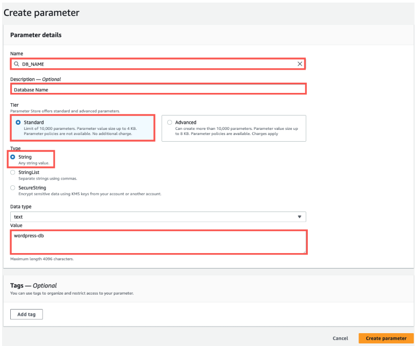

# **🔐 Configure AWS Systems Manager Parameter Store for Database Credentials**

## **📌 Overview**
When migrating my application to Amazon ECS, I need a secure way to store and retrieve database credentials. Instead of hardcoding them in my **ECS Task Definition**, I will use **AWS Systems Manager Parameter Store**.

✅ **Store sensitive database credentials securely**  
✅ **Use AWS Key Management Service (KMS) for encryption**  
✅ **Ensure credentials are easily retrievable by ECS tasks**  

---

## **🛠️ Step 1: Access Parameter Store**
📌 **I will create parameters for database connectivity.**  

1️⃣ In the **AWS Console**, go to **Services > Systems Manager**  
2️⃣ Click **Parameter Store** in the left menu  
3️⃣ Click **Create parameter**  



---

## **🛠️ Step 2: Create Database Parameters**
📌 **I will create four parameters for my WordPress database configuration.**  

For each parameter, I will enter the details below:

| Parameter Name | Type          | Value                                  |
|---------------|--------------|----------------------------------------|
| **DB_HOST**   | `String`      | `RDS endpoint`                         |
| **DB_NAME**   | `String`      | `wordpress-db`                         |
| **DB_USERNAME** | `String`   | `RDS database username`                 |
| **DB_PASSWORD** | `SecureString` | `RDS database password` (encrypted with KMS) |


---

### **🔹 Steps to Create Each Parameter**
1️⃣ **Enter Parameter Name**  
   - Example: `/wordpress/DB_HOST`
2️⃣ **Enter Description** (optional)  
   - Example: `RDS endpoint for WordPress application`
3️⃣ **Select Type**  
   - `String` for `DB_HOST`, `DB_NAME`, `DB_USERNAME`  
   - `SecureString` for `DB_PASSWORD`
4️⃣ **Select Data Type**  
   - `text`
5️⃣ **Enter Value**  
   - Example: `wordpress-db.abcdefg12345.us-west-2.rds.amazonaws.com`
6️⃣ **For `DB_PASSWORD`**, enable **SecureString** and select:  
   - **Key Management Service (KMS) Encryption:** `My current account`
7️⃣ Click **Create parameter**  


---

## **🛠️ Step 3: Verify Parameters**
📌 **I will verify the parameters were created successfully.**  

1️⃣ In **AWS Console > Systems Manager > Parameter Store**, search for `/wordpress/`  
2️⃣ I should see the four parameters listed  
3️⃣ Click on **DB_PASSWORD**, confirm it is encrypted  


---

## **🔗 Using Parameters in ECS**
📌 **These stored parameters will be retrieved by my ECS tasks using the AWS Systems Manager API.**  

In my ECS **Task Definition**, I will reference these parameters like this:

```json
{
  "name": "DB_HOST",
  "valueFrom": "/wordpress/DB_HOST"
},
{
  "name": "DB_NAME",
  "valueFrom": "/wordpress/DB_NAME"
},
{
  "name": "DB_USERNAME",
  "valueFrom": "/wordpress/DB_USERNAME"
},
{
  "name": "DB_PASSWORD",
  "valueFrom": "/wordpress/DB_PASSWORD"
}
```
✅ Now, my ECS tasks will fetch database credentials securely at runtime without hardcoding them.
⚠️ Troubleshooting
📌 If I encounter issues, I will check:

If IAM permissions allow ECS tasks to access SSM Parameter Store
That DB_PASSWORD is stored as SecureString
SSM Parameter Name matches the reference in ECS Task Definition
Check AWS CloudWatch Logs for ECS errors
AWS IAM Permissions for ECS to Access SSM

📌 Next Steps
✅ Database credentials are securely stored in Parameter Store.
➡️ Step 4: **[Deploy an AWS Application Load Balancer (ALB)](../docs/deploy-alb.md)** 
